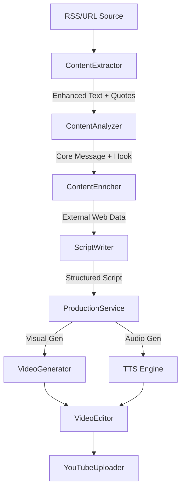

# ShortsMaker 🎬

AI-powered YouTube Shorts automation pipeline using **Google Veo 3.1** (Video) or **Imagen 3** (Image). 
ShortsMaker automatically researches, writes scripts, generates visuals, and uploads content to YouTube, allowing for a fully hands-off content creation experience.

---

## ✨ Key Features

- **Deep Content Research:** A 3-stage enrichment pipeline (Extraction, Analysis, Enrichment) that gathers deep context, expert quotes, and supplementary web data.
- **Smart Storytelling:** Automatically structures scripts into high-retention formats (Hook -> Mystery -> Secret -> Impact).
- **High-Fidelity Visuals:** Leverages Google's latest **Veo 3.1** (State-of-the-art video generation) or **Imagen 3** (High-quality image generation) via Vertex AI.
- **Automated Composition:** Native integration with `moviepy` for seamless audio-visual merging, subtitling, and BGM.
- **Modern GUI:** A clean, productive Studio interface built with **NiceGUI**.

---

## 🏗️ Architecture

ShortsMaker uses a modular pipeline designed for information density and viral storytelling:



---

## 🚀 Quick Start

### 1. Prerequisites
- Python 3.12+
- Google Cloud Project with Vertex AI enabled.
- OpenAI API Key.

### 2. Installation
```bash
# Clone the repository
git clone https://github.com/dev-mcpark/ShortsMaker.git
cd ShortsMaker

# Install as an editable package
pip install -e .
```

### 3. Setup Credentials
Place your secrets in the `config/credentials/` directory:
- `service_account.json`: Your Google Cloud Service Account key.
- `client_secrets.json`: Your YouTube OAuth 2.0 Client Secret.

Configure your API keys in `config/.env`:
```ini
OPENAI_API_KEY=sk-...
GCP_PROJECT_ID=your-project-id
```

### 4. Run ShortsMaker Studio
```bash
# Start the GUI
shorts-maker
```
Launch your browser and go to `http://localhost:8080`.

---

## 🛠️ Performance & ROI
To maximize ROI, we recommend:
- **Image Mode (Imagen 3)**: ~$0.26 per video (Recommended for high-volume testing).
- **Video Mode (Veo 3.1)**: ~$4.50 per video (Best for premium quality).

---

## 🤝 Contributing
Contributions are welcome! Please read our [CONTRIBUTING.md](CONTRIBUTING.md) for details on our code of conduct and the process for submitting pull requests.

---

## 📜 License
This project is licensed under the MIT License - see the [LICENSE](LICENSE) file for details.
