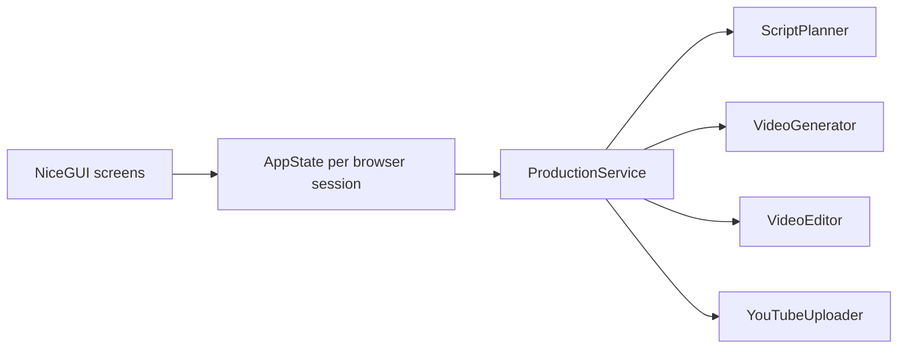

# ShortsMaker 🎬

Development map and agent handoff: [docs/README.md](docs/README.md), [docs/STATUS.md](docs/STATUS.md), and [docs/DECISIONS.md](docs/DECISIONS.md). Codex and Claude Code share [AGENTS.md](AGENTS.md) as the project instruction entry.

AI-powered YouTube Shorts automation pipeline using **Google Veo 3.1** and **Gemini image generation**.
ShortsMaker researches, writes scripts, generates visuals, and can upload content to YouTube. Review source claims and the finished video before scaling publication.
Automatic uploads are private review copies; public publication remains a separate editorial decision.

---

## ✨ Key Features

- **Deep Content Research:** A 3-stage enrichment pipeline (Extraction, Analysis, Enrichment) gathers context and web leads. Script validation compares concrete claims with the selected primary source excerpt.
- **Smart Storytelling:** Automatically structures scripts into high-retention formats (Hook -> Mystery -> Secret -> Impact).
- **Flexible Visuals:** A short Veo opening followed by Gemini images by default; full-image and full-video modes remain available.
- **Automated Composition:** Native integration with `moviepy` for seamless audio-visual merging, subtitling, and BGM.
- **Modern GUI:** A clean, productive Studio interface built with **NiceGUI**.

---

## 🏗️ Architecture

ShortsMaker is a modular monolith. The NiceGUI screens keep browser-session UI state in
`AppState` and start work through `ProductionService`. That service owns the production
sequence and progress/cancellation state; it calls the planner, media generator, editor,
and uploader. Those components contain their own external API and file operations.


```mermaid
flowchart LR
    UI[NiceGUI screens] --> State[AppState per browser session]
    State --> Service[ProductionService]
    Service --> Planner[ScriptPlanner]
    Service --> Generator[VideoGenerator]
    Service --> Editor[VideoEditor]
    Service --> Uploader[YouTubeUploader]
```

The scheduler uses the same `ProductionService` without a GUI session. Browser state is
held in memory and is lost on a server restart. API settings are process-wide, so run
separate server instances when different users need different credentials.

An article enters topic history only after its script passes validation. Studio progress
tracks completed editing work and finishes after an optional upload. Stop requests wait
for the current external API call to return before the run is released.
Planning rejects scripts without source text and asks the editorial validator to reject
claims or visual scenes that conflict with the supplied excerpt. Generated visual briefs
favor one source-grounded moment and illustrative diagrams when a realistic reconstruction
could be mistaken for actual footage. This is an LLM review, not independent fact
verification; review published material against its source.

Production estimates new visual API output cost before narration or media generation and
stops if it exceeds `MAX_VISUAL_COST_USD`. This is a planning limit, not a provider billing
cap: prompt tokens, GPT, TTS, retries, and taxes are excluded. It then checks narration length before
requesting Veo or Gemini media. It also checks for documented music before TTS or visual requests. Scene files in `outputs/clips/scenes/` are keyed by the
visual prompt, model, duration, and character overlay, so narration edits reuse them.
Changes to the Veo prompt wrapper invalidate only Veo scene cache entries.
The editor normalizes the final audio locally after rendering; this adds no API request.
To retry a failed scene from the full pipeline, keep the
script and run **Start Production** in the Generation tab; a new full pipeline run
plans a new script. Before completion and again before upload, the rendered video is
checked for Shorts length, 9:16 framing, an audio track, silent audio, and black frames.
Subtitles appear phrase by phrase inside the rendered frame; their timing is estimated from narration length and needs playback review. If a check fails, the video is retained
for preview but is not marked ready for upload.

---

## 🚀 Quick Start

### 1. Prerequisites
- Python 3.12+
- Google Cloud Project with Vertex AI enabled.
- OpenAI API Key.

### 2. Installation
```bash
# Clone the repository
git clone https://github.com/dev-mcpark/ShortsMaker.git
cd ShortsMaker

# Install as an editable package
pip install -e .
```

### 3. Setup Credentials
Place your secrets in the `config/credentials/` directory:
- `service_account.json`: Your Google Cloud Service Account key.
- `client_secrets.json`: Your YouTube OAuth 2.0 Client Secret.

Configure your API keys in `config/.env`:
```ini
OPENAI_API_KEY=sk-...
GCP_PROJECT_ID=your-project-id
```

### Music for a reviewable render

Place a track named for the selected mood (for example, `bgm/calm_review.mp3`) beside `bgm/calm_review.mp3.license.json`. The editor uses only tracks with a documented **no-attribution** license and a matching SHA-256 hash. Record the real title, artist, source page, and license after checking the source yourself:

```json
{
  "title": "Track title",
  "artist": "Artist name",
  "source_url": "https://www.youtube.com/audiolibrary",
  "license": "YouTube Audio Library standard license",
  "attribution_required": false,
  "sha256": "64-character SHA-256 of the exact MP3 file"
}
```

Run `shasum -a 256 bgm/calm_review.mp3` to obtain the hash. The code checks that the record matches the file; it cannot verify a license claim for you. [YouTube's Audio Library guide](https://support.google.com/youtube/answer/3376882?hl=en) explains its attribution filters. If no matching documented track exists, production stops before narration or visual generation rather than producing a silent video. With an explicitly selected mood, it also stops before paid script planning. Scheduled runs pause when no documented music is available or the requested mood has none, so they do not repeat avoidable paid attempts. Set BGM volume to `0` only for a deliberate silent draft. Older local MP3s without records are not selected.

### 4. Run ShortsMaker Studio
```bash
# Start the GUI
shorts-maker
```
Launch your browser and go to `http://localhost:8080`.

---

## 🛠️ Production plan and visual cost

1. **Generate a sourced, reviewable script.** Keep the existing content checks and review the hook, facts, and originality before publishing.
2. **Choose visuals by scene.** The default `hybrid` mode plans one 6-second silent Veo hook and Gemini stills for later scenes. The planner can choose a still hook when motion would imply undocumented footage. Each scene can set `visual_mode` to `image` or `video`; manual clips can replace individual scenes.
3. **Check expected spend, then reuse work.** The run stops before paid generation if new visual outputs exceed `MAX_VISUAL_COST_USD` (default $1). Completed scenes survive a failed run and narration changes.
4. **Inspect the finished video.** The editor checks length, framing, audio, and black frames before upload. The result shows expected visual API cost and reused scene count. Compare those estimates with the provider bill and YouTube retention data before increasing volume.

Using the configured models, a new 6-scene hybrid video is estimated at about **$0.65** for visuals (6 seconds of Veo Fast at $0.08/second plus five Gemini images estimated at $0.034 each). Six still images are about **$0.20**; six 8-second Veo Fast clips are about **$3.84**. These are illustrative October 2026 planning rates, not full production costs. Check [Vertex AI pricing](https://cloud.google.com/gemini-enterprise-agent-platform/generative-ai/pricing) and [model lifecycle dates](https://docs.cloud.google.com/gemini-enterprise-agent-platform/models/model-versions) before raising budgets. A Google Cloud spend cap and OpenAI account spending limit should also be configured separately.

---

## 🤝 Contributing
Contributions are welcome! Please read our [CONTRIBUTING.md](CONTRIBUTING.md) for details on our code of conduct and the process for submitting pull requests.

---

## 📜 License
This project is licensed under the MIT License - see the [LICENSE](LICENSE) file for details.
